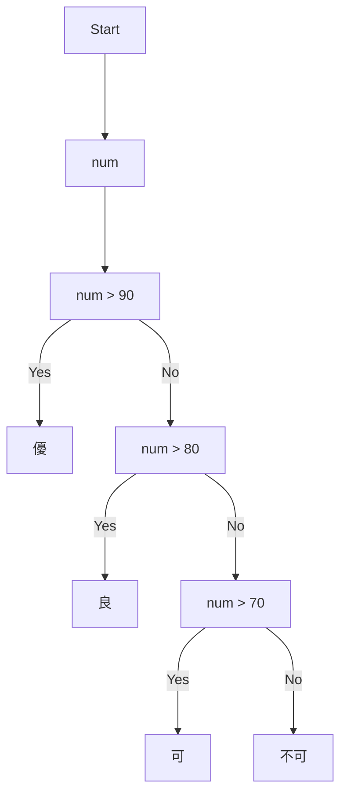

<!-- 成績評価 -->
<!-- ユーザーが入力した得点に
基づいて以下の評価基準に従って成績を
判定するプログラムを作成して下さい -->

```mermaid
flowchart TD
A[Start] ---> B[num]
B ---> C[num > 90]
C --->|Yes| Z
C --->|No| D[num > 80]
D --->|Yes| Y
D --->|No| E[num > 70]
E --->|Yes| X
E --->|No| V

Z[優]
Y[良]
X[可]
V[不可]
```
